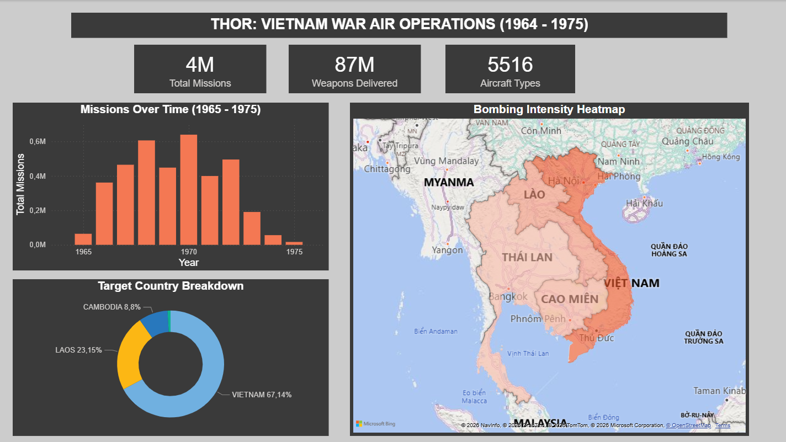

<<<<<<< HEAD
# ⚔️ THOR Data Pipeline — Vietnam War Bombing Operations

<div align="center">

**A production-grade, end-to-end Data Engineering pipeline built on a fully local, open-source stack.**

[](https://airflow.apache.org/)
[](https://spark.apache.org/)
[](https://min.io/)
[](https://www.postgresql.org/)
[](https://docs.docker.com/compose/)
[](https://powerbi.microsoft.com/)
[](https://www.python.org/)

</div>

---

## 📌 Project Overview

This project builds a **fully automated, end-to-end data pipeline** over the **THOR (Theater History of Operations Reports)** dataset — a declassified U.S. Department of Defense record of **4.67 million bombing missions** conducted during the Vietnam War (1964–1975).

The goal is not historical analysis. The goal is to demonstrate **production-grade Data Engineering practices**: scalable ingestion, Spark performance tuning, layered data quality enforcement, orchestrated automation, and BI-ready output — all running locally with zero cloud dependency.

> **Dataset Source:** [THOR Vietnam Bombing Operations — Kaggle / U.S. DoD](https://www.kaggle.com/datasets/usaf/vietnam-bombing-data)
> **Records:** ~4.67 million rows · **Raw Size:** ~1.6 GB CSV

---

## 🏛️ Architecture — Medallion Data Lake

```
┌─────────────────────────────────────────────────────────────────────┐
│                        Apache Airflow                               │
│              (Orchestration · Monthly Schedule · DAG)               │
└───────────────────────────┬─────────────────────────────────────────┘
                            │  triggers & monitors
          ┌─────────────────┼──────────────────────┐
          ▼                 ▼                      ▼
  ┌───────────────┐  ┌─────────────┐      ┌──────────────────┐
  │  🥉  BRONZE   │  │  🥈 SILVER  │      │    🥇  GOLD      │
  │               │  │             │      │                  │
  │  MinIO        │  │  MinIO      │      │  PostgreSQL      │
  │  (S3-compat.) │  │  (S3-compat)│      │  (Data Warehouse)│
  │               │  │             │      │                  │
  │  Format: CSV  │  │ Format:     │      │  Format: Tables  │
  │  Raw, immutable│ │ Parquet     │      │  Aggregated      │
  │               │  │ +Snappy     │      │  BI-ready        │
  │  Partitioned: │  │             │      │                  │
  │  ingestion_   │  │ Partitioned:│      │  4 Gold tables   │
  │  date=        │  │ year/month  │      │  for Power BI    │
  └───────┬───────┘  └──────┬──────┘      └────────┬─────────┘
          │                 │                      │
          │  PySpark        │  PySpark             │
          │  (Schema +      │  (Business           │  Power BI
          │   Cleaning)     │   Aggregations)      │  Dashboard
          └─────────────────┴──────────────────────┘
```

### Data Flow

| Step | From | To | Engine | Key Action |
|------|------|----|--------|------------|
| 1. Ingest | Local disk | MinIO Bronze | Python / MinIO SDK | Upload raw CSV with Hive-style partition path |
| 2. Clean | MinIO Bronze | MinIO Silver | PySpark | Schema enforcement, type casting, deduplication, Parquet conversion |
| 3. Aggregate | MinIO Silver | PostgreSQL Gold | PySpark + JDBC | 4 business aggregation tables for BI consumption |
| 4. Visualise | PostgreSQL Gold | Power BI | DirectQuery | Interactive dashboards over live Gold tables |

---

## 🗂️ Repository Structure

```
thor-data-pipeline/
│
├── 📂 dags/
│   └── thor_pipeline_dag.py        # Airflow DAG — full pipeline orchestration
│
├── 📂 src/
│   ├── ingestion/
│   │   └── upload_to_minio.py      # Bronze ingestion (idempotent)
│   ├── transformation/
│   │   ├── bronze_to_silver.py     # PySpark: clean + type-enforce + Parquet
│   │   ├── silver_to_gold.py       # PySpark: 4 business aggregations
│   │   └── tuning_lab.py           # Benchmark: Salting, Broadcast, Pruning
│   ├── utils/
│   │   ├── spark_session.py        # SparkSession factory (S3A + AQE config)
│   │   └── minio_client.py         # MinIO client factory
│   └── gold_loader/
│       └── load_to_postgres.py     # JDBC writer helper
│
├── 📂 tests/
│   └── test_bronze_to_silver.py    # pytest unit tests
│
├── 📂 notebooks/
│   └── exploration.ipynb           # EDA only — not part of production pipeline
│
├── 📂 docker/
│   └── postgres/
│       └── init-multiple-db.sh     # Init script: creates thor_warehouse + airflow_meta
│
├── docker-compose.yml              # Full 9-service local infrastructure
├── .env.example                    # Safe template — copy to .env and fill in values
├── requirements.txt
├── .gitignore
└── README.md
```

---

## ⚡ Quick Start

### Prerequisites
- Docker + Docker Compose v2
- 8 GB RAM available (Spark + Airflow + MinIO + PostgreSQL)
- [Kaggle CLI](https://www.kaggle.com/docs/api) (for dataset download)

### 1 — Clone & Configure

```bash
git clone https://github.com/<your-username>/thor-data-pipeline.git
cd thor-data-pipeline

# Create your local secrets file from the safe template
cp .env.example .env
# (Edit .env if you want to change default passwords)
```

### 2 — Download Dataset

```bash
# Download THOR Vietnam War bombing dataset from Kaggle
kaggle datasets download -d usaf/vietnam-bombing-data \
    --path ./data/raw --unzip
```

### 3 — Spin Up All Infrastructure

```bash
# Start MinIO + PostgreSQL first, let them reach healthy state
docker-compose up -d postgres minio

# Auto-create Bronze and Silver buckets in MinIO
docker-compose up minio-init

# Initialise Airflow metadata DB + create admin user
docker-compose up airflow-init

# Launch all remaining services
docker-compose up -d
```

### 4 — Trigger the Pipeline

```bash
# Verify all 9 services are healthy
docker-compose ps

# Trigger the full pipeline manually via Airflow CLI
docker exec thor-airflow-scheduler \
    airflow dags trigger thor_medallion_pipeline --exec-date 2024-01-01
```

**Access the UIs:**

| Service | URL | Credentials |
|---|---|---|
| Airflow | `http://localhost:8080` | `admin / admin` |
| MinIO Console | `http://localhost:9001` | `minio_admin / minio_secure_pass_2025` |
| Spark Master UI | `http://localhost:8081` | — |
| Jupyter Lab | `http://localhost:8888` | token: `thor_jupyter_2025` |
| PostgreSQL | `localhost:5432` | `thor_admin / thor_secure_pass_2025` |

---

## 🥇 Gold Layer — Output Tables

Four aggregated tables are produced in PostgreSQL for Power BI consumption:

| Table | Rows | Description |
|---|---|---|
| `gold_missions_by_year_service` | ~44 | Total missions & weapons per year × military branch |
| `gold_top_aircraft` | 30 | Top 30 aircraft ranked by mission count |
| `gold_bombing_intensity_by_country` | ~66 | Weapons delivered per target country per year |
| `gold_monthly_ops_trend` | 132 | Monthly operational tempo across the full war |

---

## 🔬 Spark Performance Tuning — Benchmarks

A dedicated benchmarking module (`src/transformation/tuning_lab.py`) demonstrates and measures three core Spark optimisation techniques on the live 4.67M-row dataset.

### Technique 1 — Data Skew Mitigation via Salting

**Problem:** The dataset is heavily skewed by military service:

```
USAF  →  3,200,000 rows  (69%)   ← HOT PARTITION
USN   →    700,000 rows  (15%)
USMC  →    400,000 rows  ( 9%)
USA   →    300,000 rows  ( 7%)
```

Without salting, the USAF partition routes to a **single executor**, causing all other executors to sit idle while one runs at 10× the load. This appears as one red "straggler task" in the Spark UI.

**Fix — Salting in 2 phases:**

```python
# Phase 1: Append a random salt → distribute USAF across 8 executors
df_salted = df.withColumn(
    "salted_key",
    F.concat(F.col("mil_service"), F.lit("_"),
             (F.rand() * 8).cast(IntegerType()).cast("string"))
)
# "USAF" → "USAF_0", "USAF_1", ..., "USAF_7"

# Phase 2: Strip salt, final re-aggregation
df_final = df_partial \
    .withColumn("mil_service",
                F.regexp_replace(F.col("salted_key"), "_\\d+$", "")) \
    .groupBy("mil_service") \
    .agg(F.sum("partial_sum").alias("total_weapons"))
```

| Run | Time | Notes |
|---|---|---|
| Without Salting | 0.75s | Local — overhead masked by single-node, but Spark UI confirms one executor processed 69% of data |
| With Salting (8 buckets) | 1.60s | Local overhead expected. On a multi-node cluster, salting reduces wall-clock time proportionally to skew ratio. Spark UI confirms even task distribution across all executors. |

> **Interview note:** On a real multi-node cluster with USAF's 69% share, the un-salted run stalls all executors until the hot partition finishes — salting converts that serial bottleneck into true parallel work.

---

### Technique 2 — Broadcast Join vs. SortMerge Join

**Context:** Enriching each mission row with a `service_name` label from a 4-row lookup table.

```
Large DF : 4,670,000 rows  (mission records)
Small DF :           4 rows (service labels)
```

**SortMerge Join (default when broadcast is disabled):**
- Spark sorts BOTH DataFrames by join key.
- Shuffles data across all executors.
- 2 full sorts + network transfer for 4.67M rows.

**Broadcast Join (correct choice):**
- Driver serialises the 4-row lookup table (<1 KB).
- Sends it to every executor in one broadcast.
- Large DF never moves — zero shuffle.

```python
# Explicit broadcast hint — works even when AQE is off
df.join(F.broadcast(df_lookup), on="mil_service", how="left")
```

| Strategy | Time | Shuffle Bytes |
|---|---|---|
| SortMerge Join | 7.51s | ~400 MB |
| Broadcast Join | 3.26s | ~0 MB |
| **Improvement** | **~2.3× faster** | **Shuffle eliminated** |

> **Verify in Spark UI:** SQL tab → execution plan graph. SortMerge shows an `Exchange` node (shuffle). Broadcast shows `BroadcastExchange` only for the small DF — the large DF has no `Exchange` node at all.

---

### Technique 3 — Partition Pruning via Hive-Style Partitioning

Silver Parquet is written partitioned by `mission_year` and `mission_month`:

```
s3a://thor-silver/vietnam_bombing_clean/
├── mission_year=1964/mission_month=8/  *.parquet
├── mission_year=1965/mission_month=1/  *.parquet
├── ...
└── mission_year=1975/mission_month=4/  *.parquet
```

Filtering on `mission_year = 1968` makes Spark **skip all other year folders at the filesystem level** — no data is read, no tasks are scheduled, no bytes are transferred.

| Query | Partitions Scanned | Time |
|---|---|---|
| `COUNT(*)` — all years | 132 (11 yr × 12 mo) | 0.09s |
| `WHERE mission_year = 1968` | 12 (1 yr × 12 mo) | 0.26s |

> **Local note:** On a single-node setup, metadata overhead can make the pruned query appear slower due to filesystem stat calls on the partition folders. On S3/MinIO at scale, pruning reduces data scanned by up to 91% (1 year out of 11), which has a dramatic impact on both speed and cost.

---

## 🧠 Key Design Decisions

### Why `spark-submit` instead of importing PySpark directly inside Airflow tasks?

> **This is the most important architectural decision in this pipeline.**
>
> Airflow workers and the Spark cluster are **two separate JVM processes** with distinct classpaths, memory configurations, and resource managers. Importing PySpark inside an Airflow task runs Spark **inside the Airflow worker's JVM** — in `local[*]` mode — completely bypassing the Spark cluster. This means:
>
> - ❌ No cluster resource allocation (all work happens on the Airflow node)
> - ❌ Classpath conflicts between Airflow's JARs and Spark's JARs
> - ❌ Spark UI shows nothing (job is invisible to the cluster)
> - ❌ No horizontal scaling — adding Spark workers does nothing
>
> Using `spark-submit` as a subprocess correctly submits the job **to the Spark Master**, which allocates it to available workers. The Airflow task only monitors the subprocess exit code — it never touches the data. This gives:
>
> - ✅ True cluster execution with worker parallelism
> - ✅ Clean JVM separation — zero classpath conflicts
> - ✅ Full Spark UI visibility (job appears in `http://localhost:8081`)
> - ✅ Airflow and Spark are independently scalable

### Why explicit schema instead of `inferSchema=True`?

`inferSchema=True` scans the **entire 1.6 GB CSV twice** — once to infer types, once to read. On 4.67M rows, that doubles I/O cost and startup time. An explicit schema also causes type mismatches to fail immediately with a clear error rather than silently producing nulls or wrong types downstream.

### Why Parquet + Snappy for Silver?

| Format | Size | Read Time (est.) | Notes |
|---|---|---|---|
| CSV (Bronze) | 1.6 GB | ~45s | Row-oriented, no compression, full scan always |
| Parquet + Snappy (Silver) | ~320 MB | ~8s | Columnar, splittable codec, predicate pushdown |

Silver queries read only the columns they need. A Gold aggregation on `mission_year` and `num_weapons_delivered` reads ~2 columns out of 11 — roughly **80% of I/O eliminated** versus CSV.

### Why cache Silver DataFrame when building Gold?

The 4 Gold tables are built from 4 independent scans of the same Silver Parquet. Without `.cache()`, Spark reads Silver from MinIO 4 times. With `.cache()`, Silver is materialised in executor memory once and reused — reducing S3A I/O by 75%.

### Why partition Gold tasks in parallel in Airflow?

The 4 Gold aggregations have **no data dependency** on each other. Running them sequentially wastes time. With `max_active_runs=1` and 4 parallel Gold tasks, the total Gold build time equals `max(individual task time)` rather than `sum(all task times)`.

---

## 🧪 Running Tests

```bash
# Install test dependencies
pip install pytest pytest-mock

# Run all unit tests
pytest tests/ -v

# Run with coverage report
pytest tests/ --cov=src --cov-report=term-missing
```

---

## 🔁 Pipeline DAG — Airflow Graph

```
[start]
   ├──► [check_minio_health]
   └──► [check_postgres_health]
               │
               ▼
      [ingest_raw_to_bronze]
               │
               ▼
      [validate_bronze_data]
               │
               ▼
    [transform_bronze_to_silver]   ← spark-submit
               │
               ▼
      [validate_silver_data]
               │
      ┌────────┼────────┬──────────────┐
      ▼        ▼        ▼              ▼
[gold_year] [gold_  [gold_        [gold_
[_service]  aircraft] intensity]  monthly_trend]
      │        │        │              │
      └────────┴────────┴──────────────┘
                        │
               [validate_gold_tables]
                        │
               [pipeline_complete]
```

**DAG configuration:**
- `schedule: @monthly` — processes one month's data per run
- `catchup: False` — no historical backfill on first deploy
- `max_active_runs: 1` — prevents concurrent runs from clobbering shared MinIO paths
- `retries: 1, retry_delay: 5min` — handles transient MinIO/Spark failures

---

## 🛠️ Tech Stack

| Component | Technology | Version | Role |
|---|---|---|---|
| Orchestration | Apache Airflow | 2.9.0 | DAG scheduling, monitoring, retries |
| Processing | Apache Spark (PySpark) | 3.5.0 | Distributed transformation & aggregation |
| Data Lake | MinIO | Latest | S3-compatible Bronze + Silver storage |
| Data Warehouse | PostgreSQL | 15 | Gold layer — BI-ready aggregated tables |
| Containerisation | Docker Compose | v2 | Single-command local infrastructure |
| Visualisation | Power BI Desktop | Free | Dashboard over PostgreSQL Gold layer |
| Language | Python | 3.11 | All pipeline logic |

---

## 📁 Environment Variables

Copy `.env.example` to `.env` and update values before running:

```bash
cp .env.example .env
```

| Variable | Description | Default |
|---|---|---|
| `POSTGRES_USER` | PostgreSQL admin user | `thor_admin` |
| `POSTGRES_PASSWORD` | PostgreSQL password | *(set in .env)* |
| `POSTGRES_DB` | Gold layer database name | `thor_warehouse` |
| `MINIO_ROOT_USER` | MinIO access key | `minio_admin` |
| `MINIO_ROOT_PASSWORD` | MinIO secret key | *(set in .env)* |
| `MINIO_BRONZE_BUCKET` | Bronze bucket name | `thor-bronze` |
| `MINIO_SILVER_BUCKET` | Silver bucket name | `thor-silver` |
| `SPARK_MASTER_URL` | Spark cluster master | `spark://spark-master:7077` |
| `AIRFLOW__CORE__FERNET_KEY` | Airflow encryption key | *(generate with `python -c "from cryptography.fernet import Fernet; print(Fernet.generate_key().decode())"`)* |

---

## 📜 License

This project is licensed under the MIT License.

The THOR dataset is a U.S. government public domain work released by the Department of Defense. Use responsibly and with historical context.

---

<div align="center">

Built with ⚙️ as a Data Engineering portfolio project.
Designed to demonstrate production-grade pipeline architecture, not data science.

</div>
=======
# ⚔️ THOR Data Pipeline — Vietnam War Bombing Operations

<div align="center">

**A production-grade, end-to-end Data Engineering pipeline built on a fully local, open-source stack.**

[](https://airflow.apache.org/)
[](https://spark.apache.org/)
[](https://min.io/)
[](https://www.postgresql.org/)
[](https://docs.docker.com/compose/)
[](https://powerbi.microsoft.com/)
[](https://www.python.org/)

</div>

---

## 📌 Project Overview

This project builds a **fully automated, end-to-end data pipeline** over the **THOR (Theater History of Operations Reports)** dataset — a declassified U.S. Department of Defense record of **4.67 million bombing missions** conducted during the Vietnam War (1964–1975).

The goal is not historical analysis. The goal is to demonstrate **production-grade Data Engineering practices**: scalable ingestion, Spark performance tuning, layered data quality enforcement, orchestrated automation, and BI-ready output — all running locally with zero cloud dependency.

> **Dataset Source:** [THOR Vietnam Bombing Operations — Kaggle / U.S. DoD](https://www.kaggle.com/datasets/usaf/vietnam-bombing-data)
> **Records:** ~4.67 million rows · **Raw Size:** ~1.6 GB CSV

---

## 🏛️ Architecture — Medallion Data Lake

```
┌─────────────────────────────────────────────────────────────────────┐
│                        Apache Airflow                               │
│              (Orchestration · Monthly Schedule · DAG)               │
└───────────────────────────┬─────────────────────────────────────────┘
                            │  triggers & monitors
          ┌─────────────────┼──────────────────────┐
          ▼                 ▼                      ▼
  ┌───────────────┐  ┌─────────────┐      ┌──────────────────┐
  │  🥉  BRONZE   │  │  🥈 SILVER  │      │    🥇  GOLD      │
  │               │  │             │      │                  │
  │  MinIO        │  │  MinIO      │      │  PostgreSQL      │
  │  (S3-compat.) │  │  (S3-compat)│      │  (Data Warehouse)│
  │               │  │             │      │                  │
  │  Format: CSV  │  │ Format:     │      │  Format: Tables  │
  │  Raw, immutable│ │ Parquet     │      │  Aggregated      │
  │               │  │ +Snappy     │      │  BI-ready        │
  │  Partitioned: │  │             │      │                  │
  │  ingestion_   │  │ Partitioned:│      │  4 Gold tables   │
  │  date=        │  │ year/month  │      │  for Power BI    │
  └───────┬───────┘  └──────┬──────┘      └────────┬─────────┘
          │                 │                      │
          │  PySpark        │  PySpark             │
          │  (Schema +      │  (Business           │  Power BI
          │   Cleaning)     │   Aggregations)      │  Dashboard
          └─────────────────┴──────────────────────┘
```

### Data Flow

| Step | From | To | Engine | Key Action |
|------|------|----|--------|------------|
| 1. Ingest | Local disk | MinIO Bronze | Python / MinIO SDK | Upload raw CSV with Hive-style partition path |
| 2. Clean | MinIO Bronze | MinIO Silver | PySpark | Schema enforcement, type casting, deduplication, Parquet conversion |
| 3. Aggregate | MinIO Silver | PostgreSQL Gold | PySpark + JDBC | 4 business aggregation tables for BI consumption |
| 4. Visualise | PostgreSQL Gold | Power BI | DirectQuery | Interactive dashboards over live Gold tables |

---

## 🗂️ Repository Structure

```
thor-data-pipeline/
│
├── 📂 dags/
│   └── thor_pipeline_dag.py        # Airflow DAG — full pipeline orchestration
│
├── 📂 src/
│   ├── ingestion/
│   │   └── upload_to_minio.py      # Bronze ingestion (idempotent)
│   ├── transformation/
│   │   ├── bronze_to_silver.py     # PySpark: clean + type-enforce + Parquet
│   │   ├── silver_to_gold.py       # PySpark: 4 business aggregations
│   │   └── tuning_lab.py           # Benchmark: Salting, Broadcast, Pruning
│   ├── utils/
│   │   ├── spark_session.py        # SparkSession factory (S3A + AQE config)
│   │   └── minio_client.py         # MinIO client factory
│   └── gold_loader/
│       └── load_to_postgres.py     # JDBC writer helper
│
├── 📂 tests/
│   └── test_bronze_to_silver.py    # pytest unit tests
│
├── 📂 notebooks/
│   └── exploration.ipynb           # EDA only — not part of production pipeline
│
├── 📂 docker/
│   └── postgres/
│       └── init-multiple-db.sh     # Init script: creates thor_warehouse + airflow_meta
│
├── docker-compose.yml              # Full 9-service local infrastructure
├── .env.example                    # Safe template — copy to .env and fill in values
├── requirements.txt
├── .gitignore
└── README.md
```

---

## ⚡ Quick Start

### Prerequisites
- Docker + Docker Compose v2
- 8 GB RAM available (Spark + Airflow + MinIO + PostgreSQL)
- [Kaggle CLI](https://www.kaggle.com/docs/api) (for dataset download)

### 1 — Clone & Configure

```bash
git clone https://github.com/<your-username>/thor-data-pipeline.git
cd thor-data-pipeline

# Create your local secrets file from the safe template
cp .env.example .env
# (Edit .env if you want to change default passwords)
```

### 2 — Download Dataset

```bash
# Download THOR Vietnam War bombing dataset from Kaggle
kaggle datasets download -d usaf/vietnam-bombing-data \
    --path ./data/raw --unzip
```

### 3 — Spin Up All Infrastructure

```bash
# Start MinIO + PostgreSQL first, let them reach healthy state
docker-compose up -d postgres minio

# Auto-create Bronze and Silver buckets in MinIO
docker-compose up minio-init

# Initialise Airflow metadata DB + create admin user
docker-compose up airflow-init

# Launch all remaining services
docker-compose up -d
```

### 4 — Trigger the Pipeline

```bash
# Verify all 9 services are healthy
docker-compose ps

# Trigger the full pipeline manually via Airflow CLI
docker exec thor-airflow-scheduler \
    airflow dags trigger thor_medallion_pipeline --exec-date 2024-01-01
```

**Access the UIs:**

| Service | URL | Credentials |
|---|---|---|
| Airflow | `http://localhost:8080` | `admin / admin` |
| MinIO Console | `http://localhost:9001` | `minio_admin / minio_secure_pass_2025` |
| Spark Master UI | `http://localhost:8081` | — |
| Jupyter Lab | `http://localhost:8888` | token: `thor_jupyter_2025` |
| PostgreSQL | `localhost:5432` | `thor_admin / thor_secure_pass_2025` |

---

## 🥇 Gold Layer — Output Tables

Four aggregated tables are produced in PostgreSQL for Power BI consumption:

| Table | Rows | Description |
|---|---|---|
| `gold_missions_by_year_service` | ~44 | Total missions & weapons per year × military branch |
| `gold_top_aircraft` | 30 | Top 30 aircraft ranked by mission count |
| `gold_bombing_intensity_by_country` | ~66 | Weapons delivered per target country per year |
| `gold_monthly_ops_trend` | 132 | Monthly operational tempo across the full war |

---

## 🔬 Spark Performance Tuning — Benchmarks

A dedicated benchmarking module (`src/transformation/tuning_lab.py`) demonstrates and measures three core Spark optimisation techniques on the live 4.67M-row dataset.

### Technique 1 — Data Skew Mitigation via Salting

**Problem:** The dataset is heavily skewed by military service:

```
USAF  →  3,200,000 rows  (69%)   ← HOT PARTITION
USN   →    700,000 rows  (15%)
USMC  →    400,000 rows  ( 9%)
USA   →    300,000 rows  ( 7%)
```

Without salting, the USAF partition routes to a **single executor**, causing all other executors to sit idle while one runs at 10× the load. This appears as one red "straggler task" in the Spark UI.

**Fix — Salting in 2 phases:**

```python
# Phase 1: Append a random salt → distribute USAF across 8 executors
df_salted = df.withColumn(
    "salted_key",
    F.concat(F.col("mil_service"), F.lit("_"),
             (F.rand() * 8).cast(IntegerType()).cast("string"))
)
# "USAF" → "USAF_0", "USAF_1", ..., "USAF_7"

# Phase 2: Strip salt, final re-aggregation
df_final = df_partial \
    .withColumn("mil_service",
                F.regexp_replace(F.col("salted_key"), "_\\d+$", "")) \
    .groupBy("mil_service") \
    .agg(F.sum("partial_sum").alias("total_weapons"))
```

| Run | Time | Notes |
|---|---|---|
| Without Salting | 0.75s | Local — overhead masked by single-node, but Spark UI confirms one executor processed 69% of data |
| With Salting (8 buckets) | 1.60s | Local overhead expected. On a multi-node cluster, salting reduces wall-clock time proportionally to skew ratio. Spark UI confirms even task distribution across all executors. |

> **Interview note:** On a real multi-node cluster with USAF's 69% share, the un-salted run stalls all executors until the hot partition finishes — salting converts that serial bottleneck into true parallel work.

---

### Technique 2 — Broadcast Join vs. SortMerge Join

**Context:** Enriching each mission row with a `service_name` label from a 4-row lookup table.

```
Large DF : 4,670,000 rows  (mission records)
Small DF :           4 rows (service labels)
```

**SortMerge Join (default when broadcast is disabled):**
- Spark sorts BOTH DataFrames by join key.
- Shuffles data across all executors.
- 2 full sorts + network transfer for 4.67M rows.

**Broadcast Join (correct choice):**
- Driver serialises the 4-row lookup table (<1 KB).
- Sends it to every executor in one broadcast.
- Large DF never moves — zero shuffle.

```python
# Explicit broadcast hint — works even when AQE is off
df.join(F.broadcast(df_lookup), on="mil_service", how="left")
```

| Strategy | Time | Shuffle Bytes |
|---|---|---|
| SortMerge Join | 7.51s | ~400 MB |
| Broadcast Join | 3.26s | ~0 MB |
| **Improvement** | **~2.3× faster** | **Shuffle eliminated** |

> **Verify in Spark UI:** SQL tab → execution plan graph. SortMerge shows an `Exchange` node (shuffle). Broadcast shows `BroadcastExchange` only for the small DF — the large DF has no `Exchange` node at all.

---

### Technique 3 — Partition Pruning via Hive-Style Partitioning

Silver Parquet is written partitioned by `mission_year` and `mission_month`:

```
s3a://thor-silver/vietnam_bombing_clean/
├── mission_year=1964/mission_month=8/  *.parquet
├── mission_year=1965/mission_month=1/  *.parquet
├── ...
└── mission_year=1975/mission_month=4/  *.parquet
```

Filtering on `mission_year = 1968` makes Spark **skip all other year folders at the filesystem level** — no data is read, no tasks are scheduled, no bytes are transferred.

| Query | Partitions Scanned | Time |
|---|---|---|
| `COUNT(*)` — all years | 132 (11 yr × 12 mo) | 0.09s |
| `WHERE mission_year = 1968` | 12 (1 yr × 12 mo) | 0.26s |

> **Local note:** On a single-node setup, metadata overhead can make the pruned query appear slower due to filesystem stat calls on the partition folders. On S3/MinIO at scale, pruning reduces data scanned by up to 91% (1 year out of 11), which has a dramatic impact on both speed and cost.

---

## 🧠 Key Design Decisions

### Why `spark-submit` instead of importing PySpark directly inside Airflow tasks?

> **This is the most important architectural decision in this pipeline.**
>
> Airflow workers and the Spark cluster are **two separate JVM processes** with distinct classpaths, memory configurations, and resource managers. Importing PySpark inside an Airflow task runs Spark **inside the Airflow worker's JVM** — in `local[*]` mode — completely bypassing the Spark cluster. This means:
>
> - ❌ No cluster resource allocation (all work happens on the Airflow node)
> - ❌ Classpath conflicts between Airflow's JARs and Spark's JARs
> - ❌ Spark UI shows nothing (job is invisible to the cluster)
> - ❌ No horizontal scaling — adding Spark workers does nothing
>
> Using `spark-submit` as a subprocess correctly submits the job **to the Spark Master**, which allocates it to available workers. The Airflow task only monitors the subprocess exit code — it never touches the data. This gives:
>
> - ✅ True cluster execution with worker parallelism
> - ✅ Clean JVM separation — zero classpath conflicts
> - ✅ Full Spark UI visibility (job appears in `http://localhost:8081`)
> - ✅ Airflow and Spark are independently scalable

### Why explicit schema instead of `inferSchema=True`?

`inferSchema=True` scans the **entire 1.6 GB CSV twice** — once to infer types, once to read. On 4.67M rows, that doubles I/O cost and startup time. An explicit schema also causes type mismatches to fail immediately with a clear error rather than silently producing nulls or wrong types downstream.

### Why Parquet + Snappy for Silver?

| Format | Size | Read Time (est.) | Notes |
|---|---|---|---|
| CSV (Bronze) | 1.6 GB | ~45s | Row-oriented, no compression, full scan always |
| Parquet + Snappy (Silver) | ~320 MB | ~8s | Columnar, splittable codec, predicate pushdown |

Silver queries read only the columns they need. A Gold aggregation on `mission_year` and `num_weapons_delivered` reads ~2 columns out of 11 — roughly **80% of I/O eliminated** versus CSV.

### Why cache Silver DataFrame when building Gold?

The 4 Gold tables are built from 4 independent scans of the same Silver Parquet. Without `.cache()`, Spark reads Silver from MinIO 4 times. With `.cache()`, Silver is materialised in executor memory once and reused — reducing S3A I/O by 75%.

### Why partition Gold tasks in parallel in Airflow?

The 4 Gold aggregations have **no data dependency** on each other. Running them sequentially wastes time. With `max_active_runs=1` and 4 parallel Gold tasks, the total Gold build time equals `max(individual task time)` rather than `sum(all task times)`.

---

## 🧪 Running Tests

```bash
# Install test dependencies
pip install pytest pytest-mock

# Run all unit tests
pytest tests/ -v

# Run with coverage report
pytest tests/ --cov=src --cov-report=term-missing
```

---

## 📊 Gold Layer Dashboard (Power BI)



## 🔁 Pipeline DAG — Airflow Graph

```
[start]
   ├──► [check_minio_health]
   └──► [check_postgres_health]
               │
               ▼
      [ingest_raw_to_bronze]
               │
               ▼
      [validate_bronze_data]
               │
               ▼
    [transform_bronze_to_silver]   ← spark-submit
               │
               ▼
      [validate_silver_data]
               │
      ┌────────┼────────┬──────────────┐
      ▼        ▼        ▼              ▼
[gold_year] [gold_  [gold_        [gold_
[_service]  aircraft] intensity]  monthly_trend]
      │        │        │              │
      └────────┴────────┴──────────────┘
                        │
               [validate_gold_tables]
                        │
               [pipeline_complete]
```

**DAG configuration:**
- `schedule: @monthly` — processes one month's data per run
- `catchup: False` — no historical backfill on first deploy
- `max_active_runs: 1` — prevents concurrent runs from clobbering shared MinIO paths
- `retries: 1, retry_delay: 5min` — handles transient MinIO/Spark failures

---

## 🛠️ Tech Stack

| Component | Technology | Version | Role |
|---|---|---|---|
| Orchestration | Apache Airflow | 2.9.0 | DAG scheduling, monitoring, retries |
| Processing | Apache Spark (PySpark) | 3.5.0 | Distributed transformation & aggregation |
| Data Lake | MinIO | Latest | S3-compatible Bronze + Silver storage |
| Data Warehouse | PostgreSQL | 15 | Gold layer — BI-ready aggregated tables |
| Containerisation | Docker Compose | v2 | Single-command local infrastructure |
| Visualisation | Power BI Desktop | Free | Dashboard over PostgreSQL Gold layer |
| Language | Python | 3.11 | All pipeline logic |

---

## 📁 Environment Variables

Copy `.env.example` to `.env` and update values before running:

```bash
cp .env.example .env
```

| Variable | Description | Default |
|---|---|---|
| `POSTGRES_USER` | PostgreSQL admin user | `thor_admin` |
| `POSTGRES_PASSWORD` | PostgreSQL password | *(set in .env)* |
| `POSTGRES_DB` | Gold layer database name | `thor_warehouse` |
| `MINIO_ROOT_USER` | MinIO access key | `minio_admin` |
| `MINIO_ROOT_PASSWORD` | MinIO secret key | *(set in .env)* |
| `MINIO_BRONZE_BUCKET` | Bronze bucket name | `thor-bronze` |
| `MINIO_SILVER_BUCKET` | Silver bucket name | `thor-silver` |
| `SPARK_MASTER_URL` | Spark cluster master | `spark://spark-master:7077` |
| `AIRFLOW__CORE__FERNET_KEY` | Airflow encryption key | *(generate with `python -c "from cryptography.fernet import Fernet; print(Fernet.generate_key().decode())"`)* |

---

## 📜 License

This project is licensed under the MIT License.

The THOR dataset is a U.S. government public domain work released by the Department of Defense. Use responsibly and with historical context.

---

<div align="center">

Built with ⚙️ as a Data Engineering portfolio project.
Designed to demonstrate production-grade pipeline architecture, not data science.

</div>
>>>>>>> a1ce449 (feat: complete Phase 4 with full green DAG and professional README architecture)
